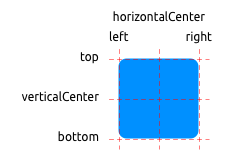
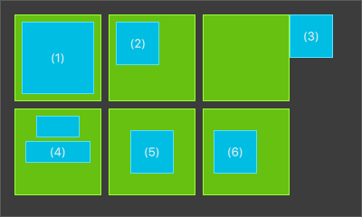

# Layout Items

QML provides a flexible way to layout items using anchors. The concept of anchoring is fundamental to `Item`, and is available to all visual QML elements. Anchors act like a contract and are stronger than competing geometry changes. Anchors are expressions of relativeness; you always need a related element to anchor with.



An element has 6 major anchor lines (`top`, `bottom`, `left`, `right`, `horizontalCenter`, `verticalCenter`). Additionally, there is the `baseline` anchor for text in `Text` elements. Each anchor line comes with an offset. In the case of the `top`, `bottom`, `left`, and `right` anchors, they are called margins. For `horizontalCenter`, `verticalCenter` and `baseline` they are called offsets.




* **(1)** An element fills a parent element.

    ```qml
    GreenSquare {
        BlueSquare {
            width: 12
            anchors.fill: parent
            anchors.margins: 8
            text: '(1)'
        }
    }
    ```
    


* **(2)** An element is left aligned to the parent.

    ```qml
    GreenSquare {
        BlueSquare {
            width: 48
            y: 8
            anchors.left: parent.left
            anchors.leftMargin: 8
            text: '(2)'
        }
    }
    ```


* **(3)** An element's left side is aligned to the parent’s right side.

    ```qml
    GreenSquare {
        BlueSquare {
            width: 48
            anchors.left: parent.right
            text: '(3)'
        }
    }
    ```


* **(4)** Center-aligned elements. `Blue1` is horizontally centered on the parent. `Blue2` is also horizontally centered, but on `Blue1`, and its top is aligned to the `Blue1` bottom line.

    ```qml
    GreenSquare {
        BlueSquare {
            id: blue1
            width: 48; height: 24
            y: 8
            anchors.horizontalCenter: parent.horizontalCenter
        }
        BlueSquare {
            id: blue2
            width: 72; height: 24
            anchors.top: blue1.bottom
            anchors.topMargin: 4
            anchors.horizontalCenter: blue1.horizontalCenter
            text: '(4)'
        }
    }
    ```


* **(5)** An element is centered on a parent element

    ```qml
    GreenSquare {
        BlueSquare {
            width: 48
            anchors.centerIn: parent
            text: '(5)'
        }
    }
    ```


* **(6)** An element is centered with a left-offset on a parent element using horizontal and vertical center lines

    ```qml
    GreenSquare {
        BlueSquare {
            width: 48
            anchors.horizontalCenter: parent.horizontalCenter
            anchors.horizontalCenterOffset: -12
            anchors.verticalCenter: parent.verticalCenter
            text: '(6)'
        }
    }
    ```

## Hidden Gems

Our squares have been magically enhanced to enable dragging. Try the example and drag around some squares. You will see that (1) can’t be dragged as it’s anchored on all sides (although you can drag the parent of (1), as it’s not anchored at all). (2) can be vertically dragged, as only the left side is anchored. The same applies to (3). (4) can only be dragged vertically, as both squares are horizontally centered. (5) is centered on the parent, and as such, can’t be dragged. The same applies to (7). Dragging an element means changing its `x,y` position. As anchoring is stronger than setting the `x,y` properties, dragging is restricted by the anchored lines. We will see this effect later when we discuss animations.

