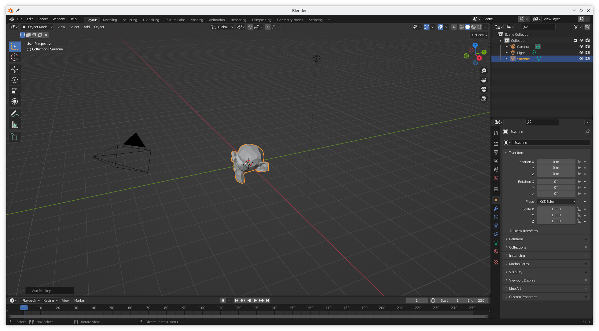
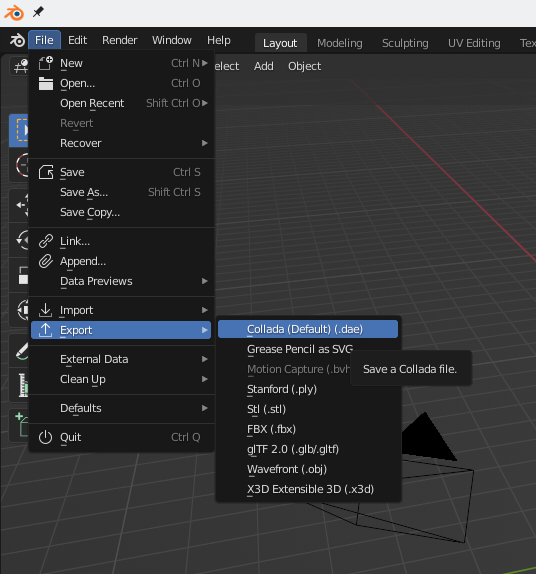
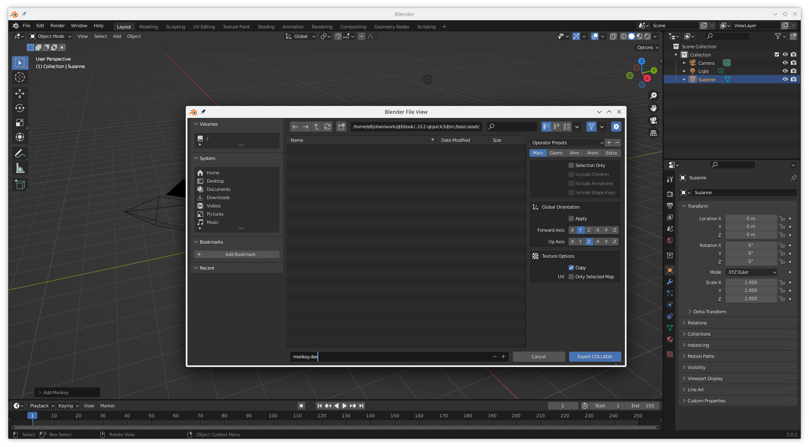
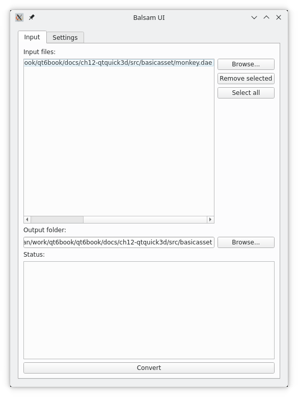
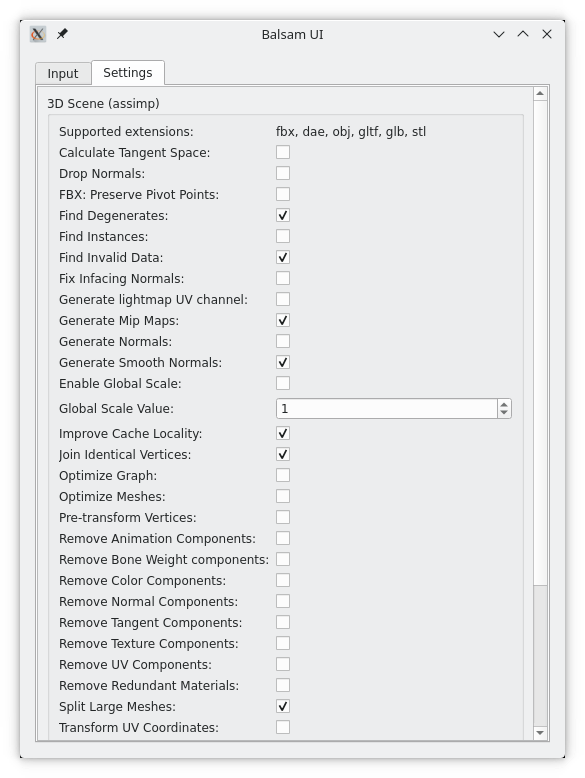
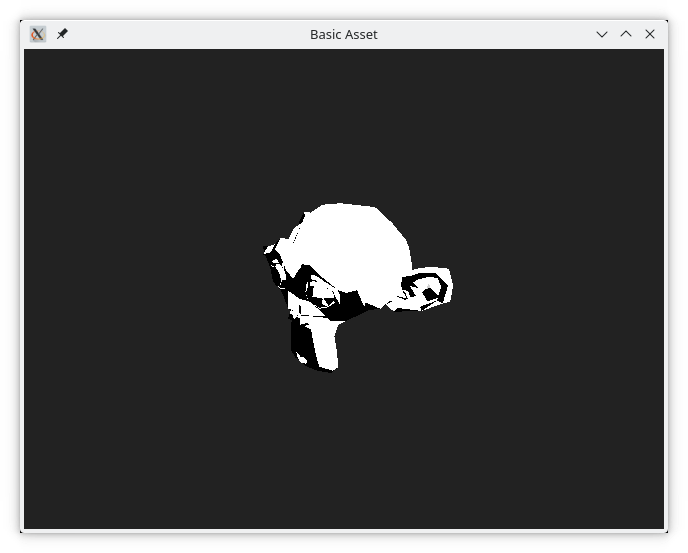
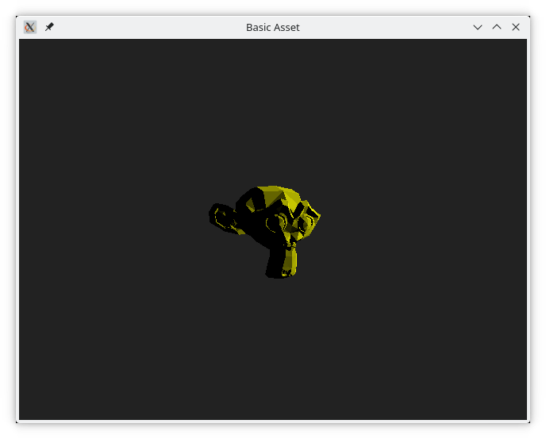

# Working with Assets

When working with 3D scenes, the built in meshes quickly grow old. Instead, a good flow from a modelling tool into QML is needed. Qt Quick 3D comes with the Balsam asset import tool, which is used to convert common asset formats into a Qt Quick 3D friendly format.

The purpose of Balsam is to make it easy to take assets created in common tools such as [Blender](https://www.blender.org/), Maya or 3ds Max and use them from Qt Quick 3D. Balsam supports the following asset types:

- COLLADA (``*.dae``)
- FBX (``*.fbx``)
- GLTF2 (``*.gltf``, ``*.glb``)
- STL (``*.stl``)
- Wavefront (``*.obj``)

For some format, texture assets can also be exported into a Qt Quick 3D-friendly format, as long as Qt Quick 3D supports the given asset.

::: tip Tip
Balsam also supports converting Qt 3D Studio projects (``*.uia``, ``*.uip``) to Qt Quick 3D. As the feature set is not identical, only the features supported by Qt Quick 3D can be converted.
:::

## Blender

To generate an asset that we can import, we will use Blender to create a scene with a monkey head in it. We will then export this as a [COLLADA](https://en.wikipedia.org/wiki/COLLADA) file to be able to convert it to a Qt Quick 3D friendly file format using Balsam.

Blender is available from [https://www.blender.org/](https://www.blender.org/), and mastering Blender is a topic for another book, so we will do the most basic thing possible. Remove the original cube, add a mesh, and select to add a monkey. There are a number of video tutorials demonstrating how to do this. The resulting Blender user interface with the monkey head scene can be seen below.



Once the head is in place, go to File -> Export -> COLLADA.



This takes you to the Export COLLADA dialog where you can export the resulting scene.



::: tip Tip
Both the blender scene and the exported COLLADA file (``*.dae``) can be found among the example files for the chapter.
:::

## Balsam

Once the COLLADA file has been saved to disk, we can prepare it for use in Qt Quick 3D using Balsam. Balsam is available as a command line tool, or through a graphical user interface, using the ``balsamui`` tool. The graphical tool is just a thin layer on top of the command line tool, so there is no difference in what you can do with either tool.

We start by adding the ``monkey.dae`` file to the input files section, and set the output folder to a reasonable path.Your paths will most likely be different from the ones shown in the screenshot.



The _Settings_ tab in the ``balsamui`` includes all the options. These all correspond to a command line option of the ``balsam`` tool. For now, we will leave all of them with their default values.



Now, go back to the _Input_ tab and click _Convert_. This will result in the following output in the status section of the user interface:
    
```
Converting 1 files...
[1/1] Successfully converted '/home/.../src/basicasset/monkey.dae'

Successfully converted all files!
```

If you started ``balsamui`` from the command line, you will also see the following output there:

```
generated file:  "/home/.../src/basicasset/Monkey.qml"
generated file:  "/home/.../src/basicasset/meshes/suzanne.mesh"
```

This means that Balsam generated a ``*.qml`` file and a ``*.mesh`` file.

## The Qt Quick 3D Assets

To use the files from a Qt Quick project we need to add them to the project. This is done in the ``CMakeLists.txt`` file, in the ``qt_add_qml_module`` macro. Add the files to the ``QML_FILES`` and ``RESOURCES`` sections as shown below.

```
qt_add_qml_module(appbasicasset
    URI basicasset
    VERSION 1.0
    QML_FILES main.qml Monkey.qml 
    RESOURCES meshes/suzanne.mesh
)
```

Having done this, we can populate a ``View3D`` with the ``Monkey.qml`` as shown below. 

<<< @/docs/ch12-qtquick3d/src/basicasset/main.qml#scene

The ``Monkey.qml`` contains the entire Blender scene, including the camera and a light, so the result is a complete scene as shown below.



The interested reader is encouraged to explore the ``Monkey.qml`` file. As you will see, it contains a completely normal Qt Quick 3D scene built from the elements we already have used in this chapter.

::: tip Tip
As ``Monkey.qml`` is generated by a tool, do not modify the file manually. If you do, your changes will be overwritten if you ever have to regenerate the file using Balsam.
:::

An alternative to using the entire scene from Blender is to use the ``*.mesh`` file in a Qt Quick 3D scene. This is demonstrated in the code below.

Here, we put a ``DirectionalLight`` and ``PerspectiveCamera`` into a ``View3D``, and combine it with the mesh using a ``Model`` element. This way, we can control the positioning, scale, and lighting from QML. We also specify a different, yellow, material for the monkey head.

<<< @/docs/ch12-qtquick3d/src/basicasset/main.qml#mesh

The resulting view is shown below.



This demonstrates how a simple mesh can be exported from a 3D design tool such as blender, converted to a Qt Quick 3D format and then used from QML. One thing to think about is that we can import the entire scene as is, i.e. using ``Monkey.qml``, or use only the assets, e.g. ``suzanne.mesh``. This puts you in control of the trade-off between simple importing of a scene, and added complexity while gaining flexibility by setting up the scene in QML.

## Tweaking

