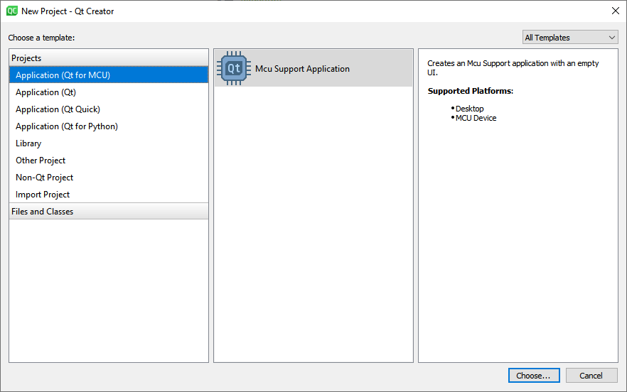
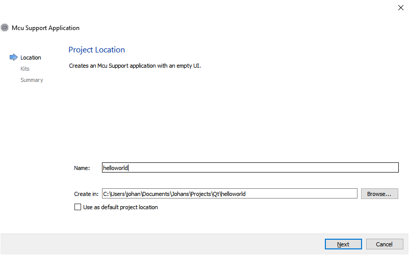
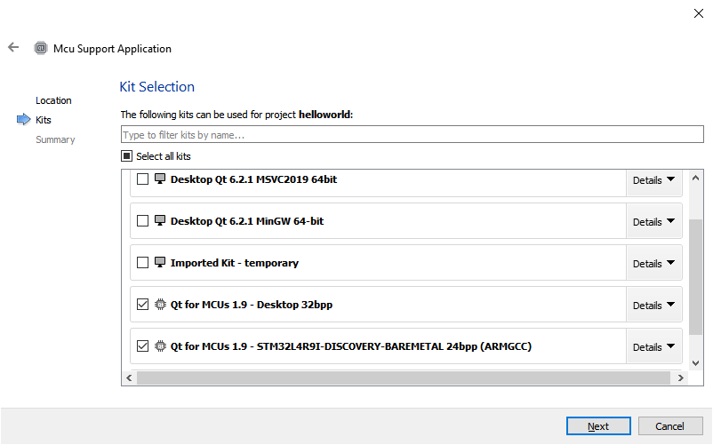
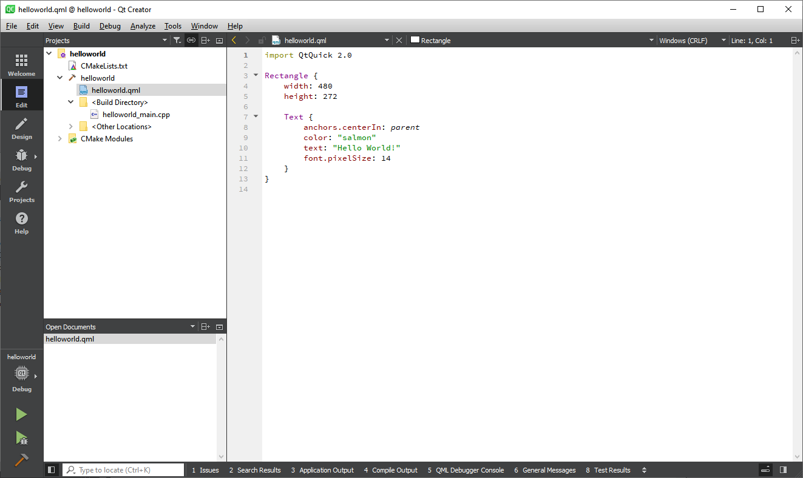
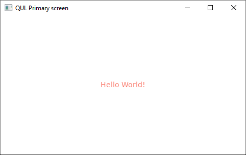
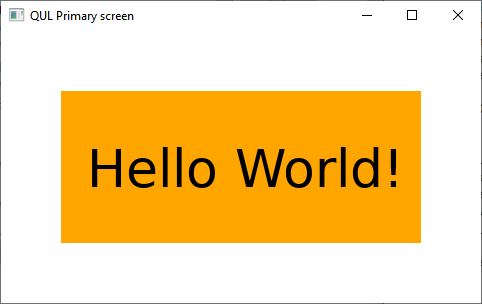
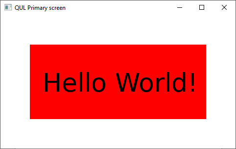

# Hello World - for MCUs

As the setup of Qt for MCU can be a bit tricky, we will start with a _Hello World_ like example to ensure that the toolchain works, and so that we can discuss the basic differences between Qt Quick Ultralite and standard Qt Quick.

First up, we need to start by creating a Qt for MCUs project in Qt Creator to get a C++ entry point into the system. When working with Qt Quick Ultralite, we cannot use a common runtime such as ``qml``. This is because Qt Quick Ultralite is translated into C++ together with optimized versions of all the assets. These are then built into a target executable. This means that there is no support for dynamic loading of QML and such - as there is no interpreter running on the target.



I call the project ``helloworld``. Feel free to pick a name of your own. The only thing changing is the name of the entry-point QML-file of the project.



Also, make sure to pick the Qt for MCUs kits when creating your project.



After a few more configuration pages, you will end up with a project as shown below.



Once the basic project is setup, run the project on your desktop and ensure that you get a window like the one shown below.



Now that we know that the installation works, replace the QML in ``helloworld.qml`` with the code shown below. We will walk through this example line by line below, but first, build and run it for your _Qt for MCU Desktop_ target. This should result in a window looking like the screenshot below the code.

<<< @/docs/ch20-qtformcu/src/helloworld/helloworld.qml#global



Click the orange rectangle, and it fades to red. Click it again and it fades back to orange.



Now, let's have a look at the source code from a Qt Quick perspective and compare.

First up, Qt Quick Ultralight ignores the version numbers after import statements. This is supported in Qt Quick since Qt 6 too by leaving out the version number, so if you can manage without it and need compatibility, make sure to leave out the version number.

```qml
import QtQuick
import QtQuickUltralite.Extras
```

In the root of our scene, we place a ``Rectangle``. This is because Qt Quick Ultralite does not provide a default, white, background. By using a ``Rectangle`` as root, we ensure that we control the background color of the scene.

```qml
Rectangle {
    width: 480
    height: 272
```

The next part, the clickable ``Rectangle``, is straight forward QML, with some Javascript bound to the ``onClicked`` event. Qt for MCUs has limited support for Javascript, so ensure to keep such scripts simple. You can read more about the specific limitations in the links at the end of this section.

```qml
    Rectangle {
        id: rect
        anchors.fill: parent
        anchors.margins: 60

        color: "orange"
        Behavior on color {
            ColorAnimation { duration: 400 }
        }

        MouseArea {
            anchors.fill: parent

            onClicked: {
                if (rect.color == "red")
                    rect.color = "orange";
                else
                    rect.color = "red";
            }
        }
    }
```

Finally, the text is rendered using a ``StaticText`` element, which is a version of the ``Text`` element for static texts. This means that the text can be rendered once, or even pre-rendered, which can save a lot of resources on a small, MCU-based, system.

```qml
    StaticText {
        anchors.centerIn: parent
        color: "black"
        text: "Hello World!"
        font.pixelSize: 52
    }
}
```

In Qt Creator, you will notice that the you get warnings around the ``StaticText`` element. This is because Qt Creator assumes that you are working with Qt Quick. To make Qt Creator aware of Qt Quick Ultralite, you need to set the ``QML_IMPORT_PATH`` to the path of your Qt for MCUs compatibility module. You can do this in your CMakeLists.txt file, or in your project settings. The project settings for a standard Windows 10 install is shown below.


In addition to what has been stated above, there are more differences. For instance, the Qt Quick Ultralite ``Item`` class, and hence the ``Rectangle`` class, lacks a lot of properties that could be found in Qt Quick. For instance, the ``scale`` and ``rotation`` properties are missing. These are only available for specific elements such as ``Image``, and there it is made available through the ``Rotation`` and ``Scale`` types instead of properties.

Going beyond the eaxmple above, there are fewer QML elements in general in Qt Quick Ultralite, but the supported types is continously growing. The intention is that the provided types cover the use-cases of the intended target devices. You can read more about this and general compatibility issues in the links provided below.

::: tip Links
Further reading at qt.io:
* [Qt Quick Ultralite vs Qt Quick](https://doc.qt.io/QtForMCUs/qtul-qtquick-differences.html)
* [Differences between Qt Quick Ultralite Controls and Qt Quick Controls](https://doc.qt.io/QtForMCUs/qtul-qtquick-controls-api-differences.html)
* [Known Issues and Limitations](https://doc.qt.io/QtForMCUs/qtul-known-issues.html)
:::
